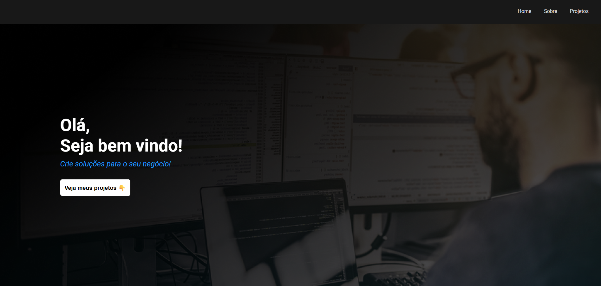
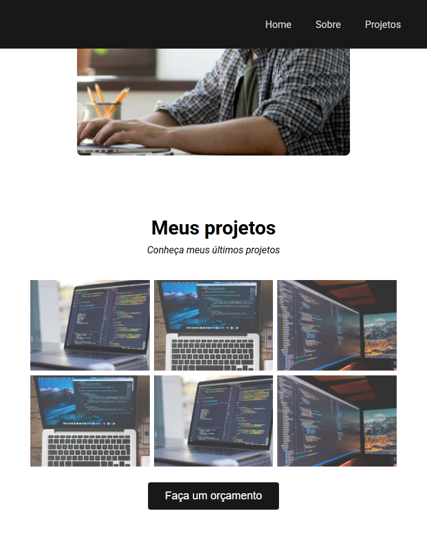

# Personal Portfolio Landing Page

This is my **first project**, a simple portfolio landing page built with **HTML** and **CSS** to practice web development fundamentals. In this project, I implemented an **in-page navigation system**. It showcases my skills and serves as a starting point for my journey to becoming a full-stack developer.

## How to Run
- **Option 1**: Clone the repository and open `index.html` in a browser.
- **Option 2**: Access this url: https://simeimoda.github.io/portfolio-page-exercise/

## Screenshot

